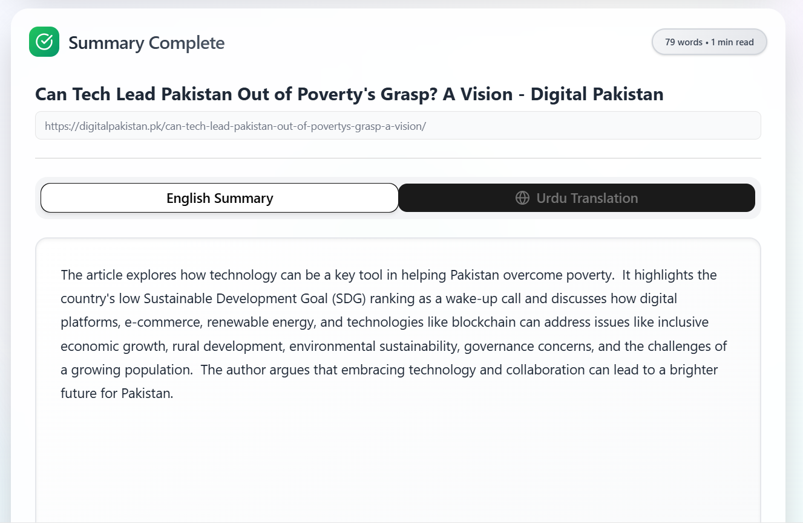

# Blog Summariser – Assignment 2

A blog summariser web app built with **Next.js**, **n8n**, **ScrapingBee**, **Supabase**, and **Google Translate API**.  
Users can enter a blog URL, which is scraped, summarized, translated to Urdu, and the results are displayed and stored.

---

## 🌐 Live Demo

Deployed on Vercel:  
👉 [nexium-ansh-assign2-auri.vercel.app](nexium-ansh-assign2-auri.vercel.app)

---

## Project Flow

### Step-by-step Flow:
1. User enters a blog URL in the UI
2. URL is sent via a webhook to an **n8n** workflow
3. **ScrapingBee API** scrapes and summarizes the blog content
4. Summary is:
   - Translated to Urdu via **Google Translate API**
   - Stored in **Supabase**
5. Both summaries are sent back to the UI using **Respond to Webhook**
6. UI displays English and Urdu summaries

---

### Visual Workflow Overview

Below is the actual n8n workflow used:

---

## Technologies Used

- **Next.js**
- **ShadCN UI + Tailwind CSS + daisyUI**
- **n8n** for automation
- **ScrapingBee API** – scraping + summarizing blog content
- **Google Translate API** – Urdu translation
- **Supabase** – storing summaries

---

## Screenshots

### UI Preview  

### Accessibility Score  

---

## Note
MongoDB not used due to flow architecture (ScrapingBee directly returns summary).
